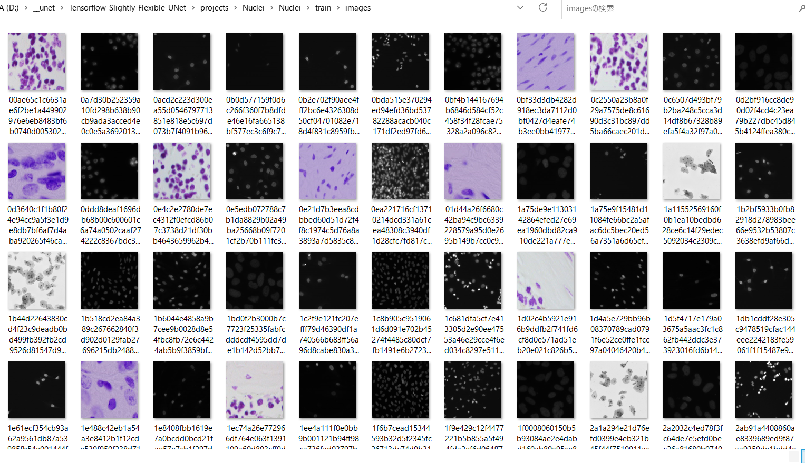
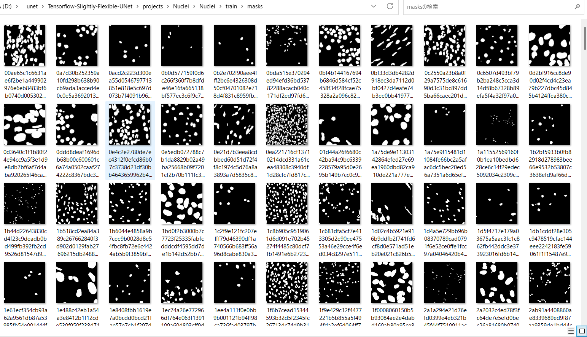
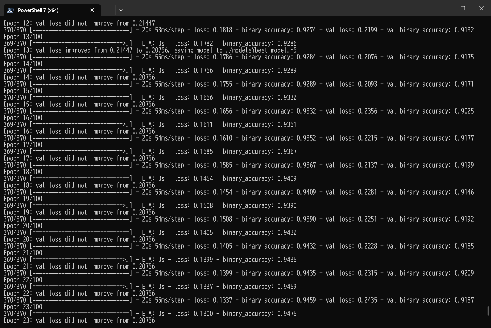
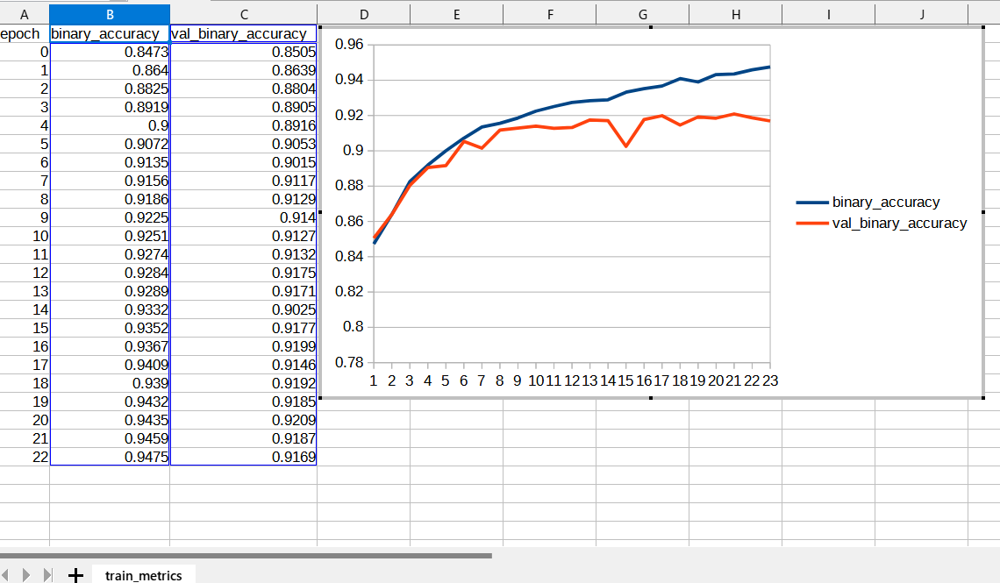
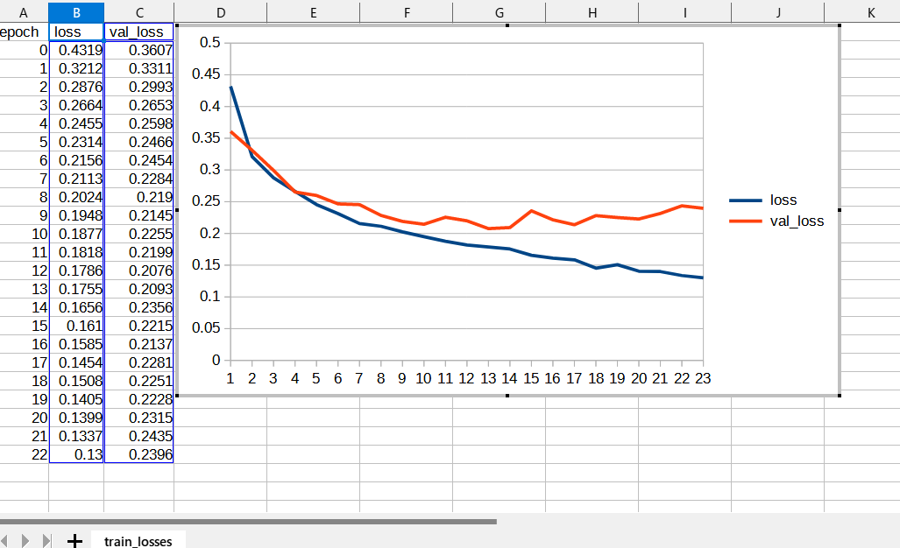
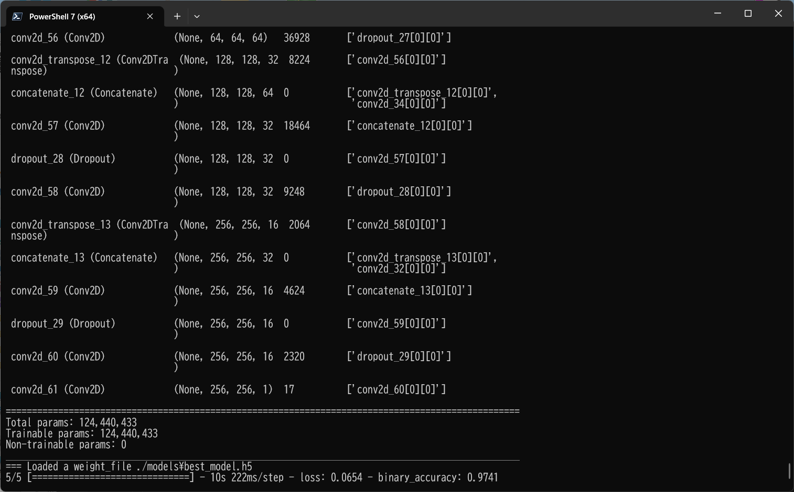
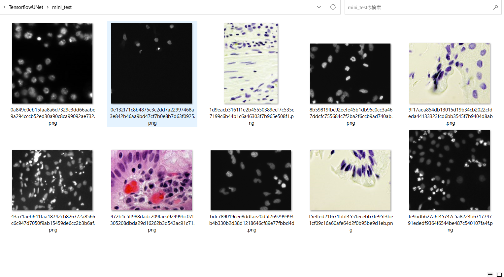
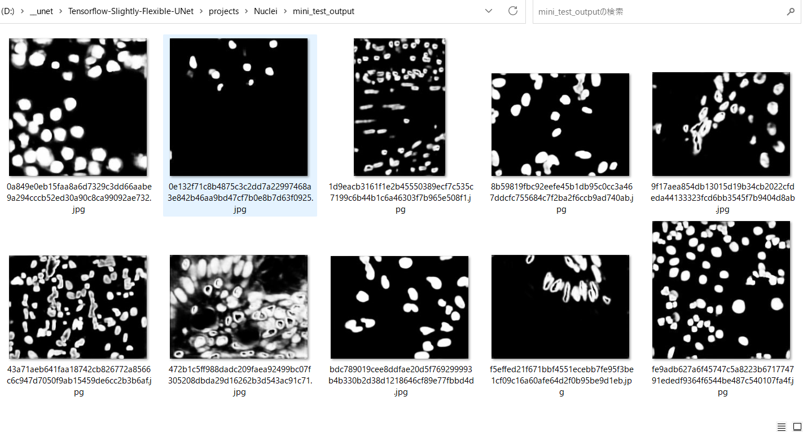
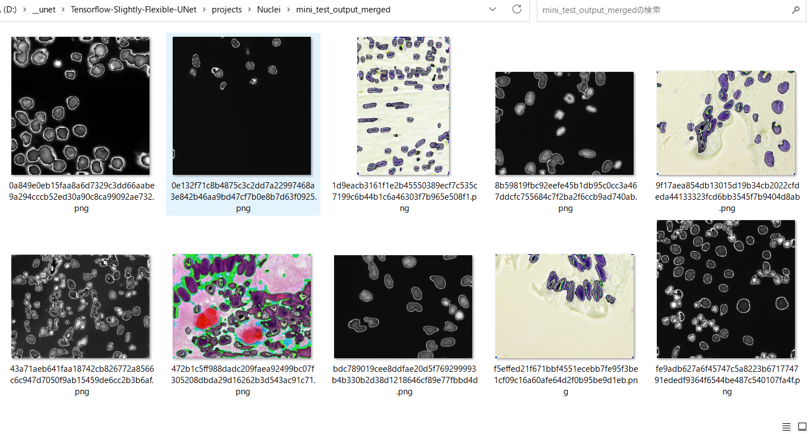

# Tensorflow-Slightly-Flexible-UNet (Updated: 2023/06/18)

<h2>
1 Tensorflow UNet Model
</h2>

This is a slightly flexible UNet Model Implementation by Tensorflow 2, which is literally flexibly cusomizable by a configuration file.

In order to write the extensible UNet Model, we have used the Python scripts in the following web sites.

<pre>
1. Keras U-Net starter - LB 0.277
 https://www.kaggle.com/code/keegil/keras-u-net-starter-lb-0-277/notebook
</pre>

See also:

<pre>
2. U-Net: Convolutional Networks for Biomedical Image Segmentation
 https://arxiv.org/pdf/1505.04597.pdf
</pre>

The sample segmentation dataset used here has been taken from the following web-site:

<pre>
2018 Data Science Bowl
Find the nuclei in divergent images to advance medical discovery
 https://www.kaggle.com/c/data-science-bowl-2018
</pre>

<ul>
<li>2023/06/18: Modified to write the merged (image+mask) inferred image files.</li>
<li>2023/06/18: Created ./projects/Nuclei folder.</li>
<li>2023/06/18: Modified to use ImageMaskDataset instead of NucleiDataset.</li>
</ul>
 
<h2>
2 Install Tensorflow-Slightly-Flexible-UNet
</h2>
<h3>
2.1 Create Python virtual env
</h3>
Please create Python3 virutal env, for example <b>unet</b>. 
<pre>
>python -m venv c:\unet
</pre>
, and activate it. 
<pre>
>cd c:\unet\
>scripts/activate
</pre>

<h3>
2.2 Clone Tensorflow-Slightly-Flexible-UNet 
</h3>

Please clone this Tensorflow-Slightly-Flexible-UNet repository to your local PC. 
<pre>
>mkdir c:\work
>cd c:\work
>git clone https://github.com/atlan-antillia/Tensorflow-Slightly-Flexible-UNet.git
</pre>

<h3>
2.3 Install Python packages 
</h3>
<pre>
>cd Tensorflow-Slightly-Flexible-UNet
>pip install -r requirements.txt
</pre>
<h3>
2.4 Folde tree
</h3>

<pre>
Tensorflow-Slightly-Flexible-UNet
├─asset
└─projects
    └─Nuclei
        ├─eval
        ├─generator
        ├─mini_test
        ├─mini_test_output
        ├─mini_test_output_merged
        ├─mini_test_output_prev
        ├─models
        ├─Nuclei
        │  ├─test
        │  │  ├─images
        │  │  └─masks
        │  ├─train
        │  │  ├─images
        │  │  └─masks
        │  └─valid
        │      ├─images
        │      └─masks
        └─test_output
</pre>

<h2>
3 Prepare Dataset
</h2>
Please download base dataset from the follwing link: 
<a href="https://www.kaggle.com/c/data-science-bowl-2018">
2018 Data Science Bowl</a>
 
, and move the following two folders in the downloaded dataset 
<pre>
stage1_test
stage1_train
</pre>
to <b>./projects/Nuclei/generator/ </b> folder. 
Please move to that generator directory, run the following command. 
<pre>
>python NucleiDatasetGenerator.py
</pre>
, by which the following <b>Nuclei</b> dataset will be generated. 
<pre>
Nuclei
├─test
│  ├─images
│  └─masks
├─train
│  ├─images
│  └─masks
└─valid
      ├─images
      └─masks
</pre> 
Samples in train/images 
 
 

Samples in train/masks 
 

 

<h2>
4 Create TensorflowUNet Model
</h2>

Please move to a sample project <b>Nuclei</b> under <b>./projects</b>. 
<pre>
> cd ./projects/Nuclei/
</pre>
Pleae run the following bat file. 
<pre>
>1.train.bat
</pre>
, which simply runs the following command. 
<pre>
>python TensorflowUNet.py  train_eval_infer.config
</pre>

You can customize your <a href="./TensorflowUNet.py">TensorflowUNet</a> Model by using a configuration file
<a href="./projects/Nuclei/train_eval_infer.config">
 <b>train_eval_infer.config</b></a>

<pre>
; train_eval_infer.config
; model section
[model]
image_width    = 256
image_height   = 256
image_channels = 3
num_classes    = 1
base_filters   = 16
num_layers     = 8
loss           = "binary_crossentropy"
metrics        = ["binary_accuracy"]
dilation       = (2, 2)
dropout_rate   = 0.05
learning_rate  = 0.001
show_summary   = True
</pre>

This TensorflowUNet is a typical classic U-Net model, and consists of two modules, Encoder and Decoder.  
The parameters defined in the configuration will be used to create the CNN layers of Encoder and Decoder. 
<table width="720" >
<tr>
<td>image_width and image_height</td>
<td>
The input image size to the first layer of Encoder. 
These values must be the same size and can take a multiple of 128. The size will depend on the dataset to be used to train your UNet Model.
</td>
</tr>

<tr>
<td>num_classes</td>
<td>The number of classes of dataset.</td>
</tr>

<tr>
<td>base_filters</td>
<td>The number of initial filters for Conv2D layer.</td>
</tr>
<tr>
<td>num_layers</td>
<td>
The number of blocks of Decoder and Encoder. 
</td>
</tr>

<tr>
<td>loss</td>
<td>The loss function name, </td>
</tr>

<tr>
<td>metrics </td>
<td>The ist of metrics function names. </td>
</tr>

<tr>
<td>dilation </td>
<td>The dilation_rate for Conv2D layer.</td>
</tr>

<tr>
<td>dropout_rate</td>
<td>The initial dropout_rate for Dropout layer </td>
</tr>

<tr>
<td>learning_rate</td>
<td>The learining_rate for Adam optimizer </td>
</tr>

</table>

 
You have to pass the filename of this configuration file to <a href="./TensorflowUNet.py">TensorflowUNet</a> constructor to create your model 
in the following way: 
<pre>
  config_file = "./train_eval_infer.config"
  model       = TensorflowUNet(config_file)
</pre>

A <b>create</b> method in the <b>TensorflowUNet</b> class is slightly simple as shown below.
It consists of two parts Encoder and Decoder, which are written by <b>for</b> loops depending
on <b>num_layers</b> defined in <b>model</b> section in that cofiguration file. 
<pre>
  def create(self, num_classes, image_height, image_width, image_channels,
            base_filters = 16, num_layers = 5):
    # inputs
    inputs = Input((image_height, image_width, image_channels))
    s= Lambda(lambda x: x / 255)(inputs)

    # Encoder
    dropout_rate = self.config.get(MODEL, "dropout_rate")
    enc         = []

    pool_size    = (2, 2)
    #kernel_sizes = [(7,7), (5,5)]
    # <experiment on="2023/06/17"> 
    base_kernels   = self.config.get(MODEL, "base_kernels", default=[(3,3)])
    kernel_sizes = []
    kernel_sizes += base_kernels
    for n in range(num_layers-len(base_kernels)):
      kernel_sizes  += [(3,3)]  
    rkernel_sizes =  kernel_sizes[::-1]
    # </experiment>
    dilation    = self.config.get(MODEL, "dilation")
  
    strides = (1,1)
    for i in range(num_layers):
      filters = base_filters * (2**i)
      kernel_size = kernel_sizes[i] #random.choice(kernel_sizes)
      c = Conv2D(filters, kernel_size, strides=strides, activation=relu, 
                 kernel_initializer='he_normal', dilation_rate=dilation, padding='same')(s)
      c = Dropout(dropout_rate * i)(c)
      c = Conv2D(filters, kernel_size, strides=strides, activation=relu, 
                 kernel_initializer='he_normal', dilation_rate=dilation, padding='same')(c)
      if i < (num_layers-1):
        p = MaxPool2D(pool_size=pool_size)(c)
        s = p
      enc.append(c)

    enc_len = len(enc)
    enc.reverse()
    n = 0
    c = enc[n]
    
    # --- Decoder
    for i in range(num_layers-1):
      kernel_size = rkernel_sizes[i] #random.choice(kernel_sizes)
      f = enc_len - 2 - i
      filters = base_filters* (2**f)
      #for kernel_size in reversed(kernel_sizes):
      u = Conv2DTranspose(filters, (2, 2), strides=(2, 2), padding='same')(c)
      n += 1
      u = concatenate([u, enc[n]])
      u = Conv2D(filters, kernel_size, strides=strides, activation=relu, 
                 kernel_initializer='he_normal', dilation_rate=dilation, padding='same')(u)
      u = Dropout(dropout_rate * f)(u)
      u = Conv2D(filters, kernel_size, strides=strides, activation=relu, 
                 kernel_initializer='he_normal', dilation_rate=dilation, padding='same')(u)
      c  = u

    # outouts
    outputs = Conv2D(num_classes, (1, 1), activation='sigmoid')(c)

    # create Model
    model = Model(inputs=[inputs], outputs=[outputs])

    return model
</pre>

You can create TensorflowUNet Model by running the following command. 
<pre>
>python TensorflowUNet.py
</pre>
You will see the summary of the model by setting. 
<pre>
[model]
show_summary   = True
</pre>
Please see <a href="#1">Appendix</a> on the summary.

<h2>
5 Train TensorflowUNet Model
</h2>
Please move to sample project <b>./projects/Nuclei</b> directory, and run the following bat file. 
<pre>
>1.train.bat
</pre>
, which simply runs the following command. 
<pre>
>python ../../TensorflowUNetTrainer.py train_eval_infer.config
</pre>
 You can customize the training-dataset by <b>train</b> section in the <b>train_eval_infer.config</b> file. 
<pre>
; train_eval_infer.config
[train]
epochs        = 100
batch_size    = 4
patience      = 10
model_dir     = "./models"
eval_dir      = "./eval"
metrics       = ["binary_accuracy", "val_binary_accuracy"]
image_datapath = "./Nuclei/train/images"
mask_datapath  = "./Nuclei/train/masks"
</pre>
This Python script will create train dataset by using <a href="./ImageMaskDataset.py">ImageMaskDataset.py</a> from
the images and masks files in the folders speccifite by the following settings
<pre>
image_datapath = "./Nuclei/train/images"
mask_datapath  = "./Nuclei/train/masks"
</pre>

, and call <b>train</b> method of TensorflowUNetModel.  
The train method is the following. 

<pre>
  def train(self, x_train, y_train): 
    batch_size = self.config.get(TRAIN, "batch_size")
    epochs     = self.config.get(TRAIN, "epochs")
    patience   = self.config.get(TRAIN, "patience")
    eval_dir   = self.config.get(TRAIN, "eval_dir")
    model_dir  = self.config.get(TRAIN, "model_dir")

    if os.path.exists(model_dir):
      shutil.rmtree(model_dir)

    if not os.path.exists(model_dir):
      os.makedirs(model_dir)
    weight_filepath   = os.path.join(model_dir, BEST_MODEL_FILE)

    early_stopping = EarlyStopping(patience=patience, verbose=1)
    check_point    = ModelCheckpoint(weight_filepath, verbose=1, save_best_only=True)
    epoch_change   = EpochChangeCallback(eval_dir)

    results = self.model.fit(x_train, y_train, 
                    validation_split=0.2, batch_size=batch_size, epochs=epochs, 
                    callbacks=[early_stopping, check_point, epoch_change],
                    verbose=1)
</pre>
, in which we pass a list of three types callbacks as an argument of <b>fit</b> method.
<pre> 
callbacks = [early_stopping, check_point, epoch_change]  
</pre>
As you know, the <b>early_stopping</b> callback created by a <b>patience</b> parameter defined 
in <b>train.config</b> file 
will be used to stop training early to avoid overfitting.
In this case, the training process has just been stopped at epoch 23 by that callback.  
 
 
<b>Train accuracies line graph</b>: 
 

 
<b>Train losses line graph</b>: 
 

<h2>
6 Evaluation
</h2>
Please move to <b>./projects/Nuclei</b> directory, and run the following bat file, 
<pre>
>2.evaluate.bat
</pre>
, which simply runs the following command. 
<pre>
>python ../../TensorflowUNetEvaluator.py train_eval_infer.config
</pre>
 You can customize the training-dataset by <b>train</b> section in the <b>train_eval_infer.configfile</b>. 
<pre>
; train_eval_infer.config
; eval section
[eval]
[eval] 
image_datapath = "./Nuclei/valid/images"
mask_datapath  = "./Nuclei/valid/masks"
</pre>

This Python script will create validation dataset by using <a href="./ImageMaskDataset.py">ImageMaskDataset.py</a> from
the images and masks files in the folders speccifite by the following settings
<pre>
image_datapath = "./Nuclei/valid/images"
mask_datapath  = "./Nuclei/valid/masks"
</pre>
 
Console output  
 

<h2>
7 Inference 
</h2>
Please move to <b>./projects/Nuclei</b> directory, and run the following bat file, 
<pre>
>3.infer.bat
</pre>
, which simply runs the following command. 
<pre>
>python ../../TensorflowUNetInferencer.py train_eval_infer.config
</pre>
 You can customize the training-dataset by <b>train</b> section in the <b>train_eval_infer.configfile</b>. 
<pre>
; train_eval_infer.config
; infer section
[infer] 
images_dir    = "./mini_test" 
output_dir    = "./mini_test_output"
merged_dir    = "./mini_test_output_merged"
</pre>
 

<b>Input images (mini_test) </b> 
  

<b>Infered images (mini_test_output)</b> 
  

<b>Merged infered images (mini_test_output_merged)</b> 
  

<a name="1">Appendix:</a> 

<pre>
__________________________________________________________________________________________________
 Layer (type)                   Output Shape         Param #     Connected to
==================================================================================================
 input_1 (InputLayer)           [(None, 256, 256, 3  0           []
                                )]

 lambda (Lambda)                (None, 256, 256, 3)  0           ['input_1[0][0]']

 conv2d (Conv2D)                (None, 256, 256, 16  448         ['lambda[0][0]']
                                )

 dropout (Dropout)              (None, 256, 256, 16  0           ['conv2d[0][0]']
                                )

 conv2d_1 (Conv2D)              (None, 256, 256, 16  2320        ['dropout[0][0]']
                                )

 max_pooling2d (MaxPooling2D)   (None, 128, 128, 16  0           ['conv2d_1[0][0]']
                                )

 conv2d_2 (Conv2D)              (None, 128, 128, 32  4640        ['max_pooling2d[0][0]']
                                )

 dropout_1 (Dropout)            (None, 128, 128, 32  0           ['conv2d_2[0][0]']
                                )

 conv2d_3 (Conv2D)              (None, 128, 128, 32  9248        ['dropout_1[0][0]']
                                )

 max_pooling2d_1 (MaxPooling2D)  (None, 64, 64, 32)  0           ['conv2d_3[0][0]']

 conv2d_4 (Conv2D)              (None, 64, 64, 64)   18496       ['max_pooling2d_1[0][0]']

 dropout_2 (Dropout)            (None, 64, 64, 64)   0           ['conv2d_4[0][0]']

 conv2d_5 (Conv2D)              (None, 64, 64, 64)   36928       ['dropout_2[0][0]']

 max_pooling2d_2 (MaxPooling2D)  (None, 32, 32, 64)  0           ['conv2d_5[0][0]']

 conv2d_6 (Conv2D)              (None, 32, 32, 128)  73856       ['max_pooling2d_2[0][0]']

 dropout_3 (Dropout)            (None, 32, 32, 128)  0           ['conv2d_6[0][0]']

 conv2d_7 (Conv2D)              (None, 32, 32, 128)  147584      ['dropout_3[0][0]']

 max_pooling2d_3 (MaxPooling2D)  (None, 16, 16, 128)  0          ['conv2d_7[0][0]']

 conv2d_8 (Conv2D)              (None, 16, 16, 256)  295168      ['max_pooling2d_3[0][0]']

 dropout_4 (Dropout)            (None, 16, 16, 256)  0           ['conv2d_8[0][0]']

 conv2d_9 (Conv2D)              (None, 16, 16, 256)  590080      ['dropout_4[0][0]']

 max_pooling2d_4 (MaxPooling2D)  (None, 8, 8, 256)   0           ['conv2d_9[0][0]']

 conv2d_10 (Conv2D)             (None, 8, 8, 512)    1180160     ['max_pooling2d_4[0][0]']

 dropout_5 (Dropout)            (None, 8, 8, 512)    0           ['conv2d_10[0][0]']

 conv2d_11 (Conv2D)             (None, 8, 8, 512)    2359808     ['dropout_5[0][0]']

 max_pooling2d_5 (MaxPooling2D)  (None, 4, 4, 512)   0           ['conv2d_11[0][0]']

 conv2d_12 (Conv2D)             (None, 4, 4, 1024)   4719616     ['max_pooling2d_5[0][0]']

 dropout_6 (Dropout)            (None, 4, 4, 1024)   0           ['conv2d_12[0][0]']

 conv2d_13 (Conv2D)             (None, 4, 4, 1024)   9438208     ['dropout_6[0][0]']

 max_pooling2d_6 (MaxPooling2D)  (None, 2, 2, 1024)  0           ['conv2d_13[0][0]']

 conv2d_14 (Conv2D)             (None, 2, 2, 2048)   18876416    ['max_pooling2d_6[0][0]']

 dropout_7 (Dropout)            (None, 2, 2, 2048)   0           ['conv2d_14[0][0]']

 conv2d_15 (Conv2D)             (None, 2, 2, 2048)   37750784    ['dropout_7[0][0]']

 conv2d_transpose (Conv2DTransp  (None, 4, 4, 1024)  8389632     ['conv2d_15[0][0]']
 ose)

 concatenate (Concatenate)      (None, 4, 4, 2048)   0           ['conv2d_transpose[0][0]',
                                                                  'conv2d_13[0][0]']

 conv2d_16 (Conv2D)             (None, 4, 4, 1024)   18875392    ['concatenate[0][0]']

 dropout_8 (Dropout)            (None, 4, 4, 1024)   0           ['conv2d_16[0][0]']

 conv2d_17 (Conv2D)             (None, 4, 4, 1024)   9438208     ['dropout_8[0][0]']

 conv2d_transpose_1 (Conv2DTran  (None, 8, 8, 512)   2097664     ['conv2d_17[0][0]']
 spose)

 concatenate_1 (Concatenate)    (None, 8, 8, 1024)   0           ['conv2d_transpose_1[0][0]',
                                                                  'conv2d_11[0][0]']

 conv2d_18 (Conv2D)             (None, 8, 8, 512)    4719104     ['concatenate_1[0][0]']

 dropout_9 (Dropout)            (None, 8, 8, 512)    0           ['conv2d_18[0][0]']

 conv2d_19 (Conv2D)             (None, 8, 8, 512)    2359808     ['dropout_9[0][0]']

 conv2d_transpose_2 (Conv2DTran  (None, 16, 16, 256)  524544     ['conv2d_19[0][0]']
 spose)

 concatenate_2 (Concatenate)    (None, 16, 16, 512)  0           ['conv2d_transpose_2[0][0]',
                                                                  'conv2d_9[0][0]']

 conv2d_20 (Conv2D)             (None, 16, 16, 256)  1179904     ['concatenate_2[0][0]']

 dropout_10 (Dropout)           (None, 16, 16, 256)  0           ['conv2d_20[0][0]']

 conv2d_21 (Conv2D)             (None, 16, 16, 256)  590080      ['dropout_10[0][0]']

 conv2d_transpose_3 (Conv2DTran  (None, 32, 32, 128)  131200     ['conv2d_21[0][0]']
 spose)

 concatenate_3 (Concatenate)    (None, 32, 32, 256)  0           ['conv2d_transpose_3[0][0]',
                                                                  'conv2d_7[0][0]']

 conv2d_22 (Conv2D)             (None, 32, 32, 128)  295040      ['concatenate_3[0][0]']

 dropout_11 (Dropout)           (None, 32, 32, 128)  0           ['conv2d_22[0][0]']

 conv2d_23 (Conv2D)             (None, 32, 32, 128)  147584      ['dropout_11[0][0]']

 conv2d_transpose_4 (Conv2DTran  (None, 64, 64, 64)  32832       ['conv2d_23[0][0]']
 spose)

 concatenate_4 (Concatenate)    (None, 64, 64, 128)  0           ['conv2d_transpose_4[0][0]',
                                                                  'conv2d_5[0][0]']

 conv2d_24 (Conv2D)             (None, 64, 64, 64)   73792       ['concatenate_4[0][0]']

 dropout_12 (Dropout)           (None, 64, 64, 64)   0           ['conv2d_24[0][0]']

 conv2d_25 (Conv2D)             (None, 64, 64, 64)   36928       ['dropout_12[0][0]']

 conv2d_transpose_5 (Conv2DTran  (None, 128, 128, 32  8224       ['conv2d_25[0][0]']
 spose)                         )

 concatenate_5 (Concatenate)    (None, 128, 128, 64  0           ['conv2d_transpose_5[0][0]',
                                )                                 'conv2d_3[0][0]']

 conv2d_26 (Conv2D)             (None, 128, 128, 32  18464       ['concatenate_5[0][0]']
                                )

 dropout_13 (Dropout)           (None, 128, 128, 32  0           ['conv2d_26[0][0]']
                                )

 conv2d_27 (Conv2D)             (None, 128, 128, 32  9248        ['dropout_13[0][0]']
                                )

 conv2d_transpose_6 (Conv2DTran  (None, 256, 256, 16  2064       ['conv2d_27[0][0]']
 spose)                         )

 concatenate_6 (Concatenate)    (None, 256, 256, 32  0           ['conv2d_transpose_6[0][0]',
                                )                                 'conv2d_1[0][0]']

 conv2d_28 (Conv2D)             (None, 256, 256, 16  4624        ['concatenate_6[0][0]']
                                )

 dropout_14 (Dropout)           (None, 256, 256, 16  0           ['conv2d_28[0][0]']
                                )

 conv2d_29 (Conv2D)             (None, 256, 256, 16  2320        ['dropout_14[0][0]']
                                )

 conv2d_30 (Conv2D)             (None, 256, 256, 1)  17          ['conv2d_29[0][0]']

==================================================================================================
</pre>

