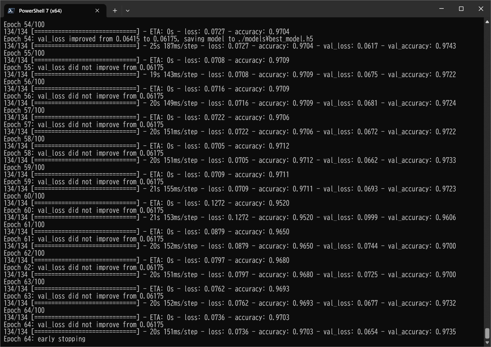
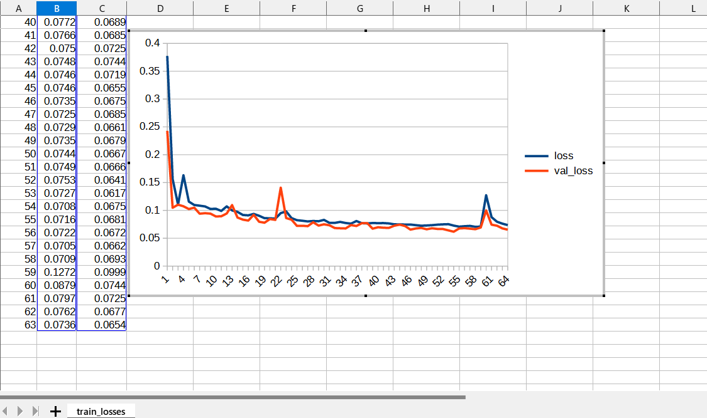

# TensorflowUNet (Updated: 2023/05/05)

<h2>
1 Tensorflow UNet Model
</h2>

This is a slightly flexible UNet Model Implementation by Tensorflow 2.

In order to write the extensible UNet Model, we have used the Python scripts in the following web sites.

<pre>
1. Keras U-Net starter - LB 0.277
 https://www.kaggle.com/code/keegil/keras-u-net-starter-lb-0-277/notebook
2. U-Net Image Segmentation in Keras
 https://androidkt.com/tensorflow-keras-unet-for-image-image-segmentation/
</pre>

See also:

<pre>
3. U-Net: Convolutional Networks for Biomedical Image Segmentation
 https://arxiv.org/pdf/1505.04597.pdf
</pre>

<h2>
2 Create TensorflowUNet Model
</h2>
 You can customize your TensorflowUnNet model by using a configration file. 

<pre>
; model.config
[model]
image_width    = 256
image_height   = 256
image_channels = 3

num_classes    = 1
base_filters   = 16
num_layers     = 8
dropout_rate   = 0.05
learning_rate  = 0.001

</pre>
You will pass the filename of this configuration file to <a href="./TensorflowUNet.py">TensorflowUNet</a> constructor to create your model 
in the following way: 
<pre>
  config_file = "./model.config"
  model       = TensorflowUNet(config_file)
</pre>
You can create TensorflowUNet by running the following command. 
<pre>
>python TensorflowUNet.py
</pre>
You will see the following summary of the model. 
<pre>
__________________________________________________________________________________________________
 Layer (type)                   Output Shape         Param #     Connected to
==================================================================================================
 input_1 (InputLayer)           [(None, 256, 256, 3  0           []
                                )]

 lambda (Lambda)                (None, 256, 256, 3)  0           ['input_1[0][0]']

 conv2d (Conv2D)                (None, 256, 256, 16  448         ['lambda[0][0]']
                                )

 dropout (Dropout)              (None, 256, 256, 16  0           ['conv2d[0][0]']
                                )

 conv2d_1 (Conv2D)              (None, 256, 256, 16  2320        ['dropout[0][0]']
                                )

 max_pooling2d (MaxPooling2D)   (None, 128, 128, 16  0           ['conv2d_1[0][0]']
                                )

 conv2d_2 (Conv2D)              (None, 128, 128, 32  4640        ['max_pooling2d[0][0]']
                                )

 dropout_1 (Dropout)            (None, 128, 128, 32  0           ['conv2d_2[0][0]']
                                )

 conv2d_3 (Conv2D)              (None, 128, 128, 32  9248        ['dropout_1[0][0]']
                                )

 max_pooling2d_1 (MaxPooling2D)  (None, 64, 64, 32)  0           ['conv2d_3[0][0]']

 conv2d_4 (Conv2D)              (None, 64, 64, 64)   18496       ['max_pooling2d_1[0][0]']

 dropout_2 (Dropout)            (None, 64, 64, 64)   0           ['conv2d_4[0][0]']

 conv2d_5 (Conv2D)              (None, 64, 64, 64)   36928       ['dropout_2[0][0]']

 max_pooling2d_2 (MaxPooling2D)  (None, 32, 32, 64)  0           ['conv2d_5[0][0]']

 conv2d_6 (Conv2D)              (None, 32, 32, 128)  73856       ['max_pooling2d_2[0][0]']

 dropout_3 (Dropout)            (None, 32, 32, 128)  0           ['conv2d_6[0][0]']

 conv2d_7 (Conv2D)              (None, 32, 32, 128)  147584      ['dropout_3[0][0]']

 max_pooling2d_3 (MaxPooling2D)  (None, 16, 16, 128)  0          ['conv2d_7[0][0]']

 conv2d_8 (Conv2D)              (None, 16, 16, 256)  295168      ['max_pooling2d_3[0][0]']

 dropout_4 (Dropout)            (None, 16, 16, 256)  0           ['conv2d_8[0][0]']

 conv2d_9 (Conv2D)              (None, 16, 16, 256)  590080      ['dropout_4[0][0]']

 max_pooling2d_4 (MaxPooling2D)  (None, 8, 8, 256)   0           ['conv2d_9[0][0]']

 conv2d_10 (Conv2D)             (None, 8, 8, 512)    1180160     ['max_pooling2d_4[0][0]']

 dropout_5 (Dropout)            (None, 8, 8, 512)    0           ['conv2d_10[0][0]']

 conv2d_11 (Conv2D)             (None, 8, 8, 512)    2359808     ['dropout_5[0][0]']

 max_pooling2d_5 (MaxPooling2D)  (None, 4, 4, 512)   0           ['conv2d_11[0][0]']

 conv2d_12 (Conv2D)             (None, 4, 4, 1024)   4719616     ['max_pooling2d_5[0][0]']

 dropout_6 (Dropout)            (None, 4, 4, 1024)   0           ['conv2d_12[0][0]']

 conv2d_13 (Conv2D)             (None, 4, 4, 1024)   9438208     ['dropout_6[0][0]']

 max_pooling2d_6 (MaxPooling2D)  (None, 2, 2, 1024)  0           ['conv2d_13[0][0]']

 conv2d_14 (Conv2D)             (None, 2, 2, 2048)   18876416    ['max_pooling2d_6[0][0]']

 dropout_7 (Dropout)            (None, 2, 2, 2048)   0           ['conv2d_14[0][0]']

 conv2d_15 (Conv2D)             (None, 2, 2, 2048)   37750784    ['dropout_7[0][0]']

 conv2d_transpose (Conv2DTransp  (None, 4, 4, 1024)  8389632     ['conv2d_15[0][0]']
 ose)

 concatenate (Concatenate)      (None, 4, 4, 2048)   0           ['conv2d_transpose[0][0]',
                                                                  'conv2d_13[0][0]']

 conv2d_16 (Conv2D)             (None, 4, 4, 1024)   18875392    ['concatenate[0][0]']

 dropout_8 (Dropout)            (None, 4, 4, 1024)   0           ['conv2d_16[0][0]']

 conv2d_17 (Conv2D)             (None, 4, 4, 1024)   9438208     ['dropout_8[0][0]']

 conv2d_transpose_1 (Conv2DTran  (None, 8, 8, 512)   2097664     ['conv2d_17[0][0]']
 spose)

 concatenate_1 (Concatenate)    (None, 8, 8, 1024)   0           ['conv2d_transpose_1[0][0]',
                                                                  'conv2d_11[0][0]']

 conv2d_18 (Conv2D)             (None, 8, 8, 512)    4719104     ['concatenate_1[0][0]']

 dropout_9 (Dropout)            (None, 8, 8, 512)    0           ['conv2d_18[0][0]']

 conv2d_19 (Conv2D)             (None, 8, 8, 512)    2359808     ['dropout_9[0][0]']

 conv2d_transpose_2 (Conv2DTran  (None, 16, 16, 256)  524544     ['conv2d_19[0][0]']
 spose)

 concatenate_2 (Concatenate)    (None, 16, 16, 512)  0           ['conv2d_transpose_2[0][0]',
                                                                  'conv2d_9[0][0]']

 conv2d_20 (Conv2D)             (None, 16, 16, 256)  1179904     ['concatenate_2[0][0]']

 dropout_10 (Dropout)           (None, 16, 16, 256)  0           ['conv2d_20[0][0]']

 conv2d_21 (Conv2D)             (None, 16, 16, 256)  590080      ['dropout_10[0][0]']

 conv2d_transpose_3 (Conv2DTran  (None, 32, 32, 128)  131200     ['conv2d_21[0][0]']
 spose)

 concatenate_3 (Concatenate)    (None, 32, 32, 256)  0           ['conv2d_transpose_3[0][0]',
                                                                  'conv2d_7[0][0]']

 conv2d_22 (Conv2D)             (None, 32, 32, 128)  295040      ['concatenate_3[0][0]']

 dropout_11 (Dropout)           (None, 32, 32, 128)  0           ['conv2d_22[0][0]']

 conv2d_23 (Conv2D)             (None, 32, 32, 128)  147584      ['dropout_11[0][0]']

 conv2d_transpose_4 (Conv2DTran  (None, 64, 64, 64)  32832       ['conv2d_23[0][0]']
 spose)

 concatenate_4 (Concatenate)    (None, 64, 64, 128)  0           ['conv2d_transpose_4[0][0]',
                                                                  'conv2d_5[0][0]']

 conv2d_24 (Conv2D)             (None, 64, 64, 64)   73792       ['concatenate_4[0][0]']

 dropout_12 (Dropout)           (None, 64, 64, 64)   0           ['conv2d_24[0][0]']

 conv2d_25 (Conv2D)             (None, 64, 64, 64)   36928       ['dropout_12[0][0]']

 conv2d_transpose_5 (Conv2DTran  (None, 128, 128, 32  8224       ['conv2d_25[0][0]']
 spose)                         )

 concatenate_5 (Concatenate)    (None, 128, 128, 64  0           ['conv2d_transpose_5[0][0]',
                                )                                 'conv2d_3[0][0]']

 conv2d_26 (Conv2D)             (None, 128, 128, 32  18464       ['concatenate_5[0][0]']
                                )

 dropout_13 (Dropout)           (None, 128, 128, 32  0           ['conv2d_26[0][0]']
                                )

 conv2d_27 (Conv2D)             (None, 128, 128, 32  9248        ['dropout_13[0][0]']
                                )

 conv2d_transpose_6 (Conv2DTran  (None, 256, 256, 16  2064       ['conv2d_27[0][0]']
 spose)                         )

 concatenate_6 (Concatenate)    (None, 256, 256, 32  0           ['conv2d_transpose_6[0][0]',
                                )                                 'conv2d_1[0][0]']

 conv2d_28 (Conv2D)             (None, 256, 256, 16  4624        ['concatenate_6[0][0]']
                                )

 dropout_14 (Dropout)           (None, 256, 256, 16  0           ['conv2d_28[0][0]']
                                )

 conv2d_29 (Conv2D)             (None, 256, 256, 16  2320        ['dropout_14[0][0]']
                                )

 conv2d_30 (Conv2D)             (None, 256, 256, 1)  17          ['conv2d_29[0][0]']

==================================================================================================
</pre>

<h2>
3 Train TensorflowUNet Model
</h2>

 You can create and train your TensorflowUNet model by using a configuration file. 
<pre>
[model]
image_width    = 256
image_height   = 256
image_channels = 3

num_classes    = 1
base_filters   = 16
num_layers     = 8
dropout_rate   = 0.05
learning_rate  = 0.001

[train]
epochs        = 100
batch_size    = 4
patience      = 10
model_dir     = "./models"
eval_dir      = "./eval"
</pre>
This setting of the configuration is a case of Nuclei dataset. 

Please see the following web site on Nuclei dataset. 
<a href="https://www.kaggle.com/competitions/data-science-bowl-2018">2018 Data Science Bowl</a> 
Find the nuclei in divergent images to advance medical discovery

 
Please download dataset from the following link: 
<a href="https://www.kaggle.com/competitions/data-science-bowl-2018/data">data-science-bowl-2018/data</a>
 
We have also created <a href="./NucleiDataset.py">NucleiDataset</a> class to create <b>train</b> dataset from the 
the download file. The implementation of the class is based on the tutorial code in Kaggle web site.   
You can run the following Python script <a href="./TensorflowUNetNucleiTrainer.py">TensorflowUNetNucleiTrainer.py</a>. 
<pre>
>python TensorflowUNetNucleiTrainer.py
</pre>
 
 
<b>Train accuracies line graph</b>: 
 

 
<b>Train losses line graph</b>: 
 

